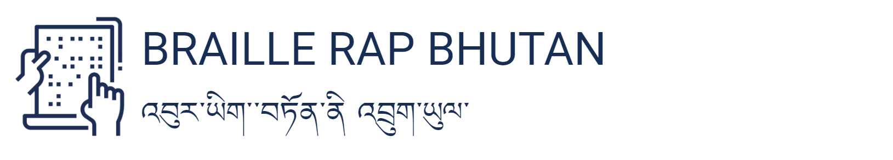

# BrailleRapUI
- See a demo online: https://braille-rap-ui.ok-y.xyz
- This project was created as a part of the team effort of the **Assistive Learning Units (ALU)** group from the CST Fablab in Phuentsholing, Bhutan for the Fab Bhutan Challenge 2023 - Designing Resilient Futures. 
- The project was created for the BrailleRap Bhutan iteration https://github.com/kyjanond/BrailleRap
- Parts of the code are modified pieces of the https://github.com/crocsg/BrailleRap project.
- It was created fast, dirty and it probably contains lots of bugs. No guarantees.

### install and run
```
yarn install
yarn dev
```
